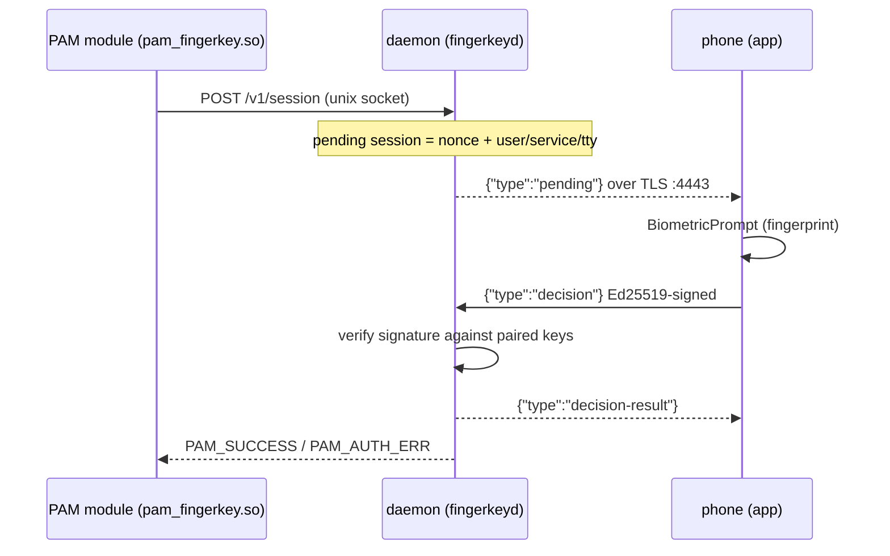
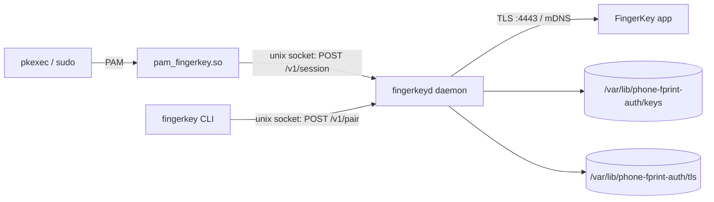

<p align="center">
  
</p>

# FingerKey

Authenticate sudo, pkexec, SSH, login and any other PAM-aware prompt with your fingerprint on your phone, over your LAN. No password typed.

<p align="center">
  <a href="https://github.com/7emotions/fingerkey/blob/master/LICENSE"></a>
  
  
</p>

When a privilege escalation runs, a PAM module asks a local daemon to create a pending approval session. The daemon pushes the request over TLS to your phone, you approve or deny with BiometricPrompt, and the phone returns an Ed25519-signed decision that the daemon verifies before PAM lets the command through. The computer and the phone talk directly over TCP on the local network; nothing leaves the LAN.

## How it works



Approve: sudo/pkexec proceeds. Deny or timeout (60 seconds): the PAM module falls through and the normal password prompt appears.

Fast fallback: if no phone is paired, or no registered phone is connected, the daemon answers session creation with HTTP 503 and PAM falls back to the password prompt immediately. No 60 second wait, no lockout risk.

## Transport and security

The phone link is TLS over TCP (default port 4443). The daemon holds a self-signed ECDSA P-256 certificate (CN=phone-fprint-auth), generated on first start under `-tls-dir`. There is no CA and no public DNS: the phone **pins the certificate fingerprint**, the lowercase hex SHA-256 of the certificate's DER form, and refuses any other server.

- The daemon advertises `_phonefprint._tcp` over mDNS (in process, no Avahi needed), with the fingerprint in a TXT record (`fp=<hex>`, `v=1`). The app uses it to rediscover computers and reconnect.
- Decisions are Ed25519 signatures over a message that binds the fresh per-session nonce and the context (`user`, `service`, `tty`). The nonce is one-time and the session expires after 60 seconds, so a captured decision cannot be replayed against a different request.
- The unix socket at `/run/phone-fprint-auth/daemon.sock` (mode 0700) is root-only. Only root, or a setuid-root process such as the PAM module, can create or poll a session.
- Only registered phones receive pushes. A TLS client that completes the handshake but does not present a paired key (or a valid pairing token) gets `welcome{registered:false}` and is disconnected: it sees no pending sessions and no decision results.

Frames are length-prefixed JSON (4-byte big-endian length plus payload):

- `{"type":"hello",...}` phone → daemon, first frame: pubkey, optional pairing token
- `{"type":"welcome",...}` / `{"type":"registered",...}` daemon → phone, link registered
- `{"type":"pending",...}` daemon → phone, one per new session
- `{"type":"decision",...}` phone → daemon, signed approve or deny
- `{"type":"decision-result",...}` daemon → phone, verdict on the decision
- `{"type":"ping"}` / `{"type":"pong"}` keepalive

## Components



| Path | What it is |
| --- | --- |
| `daemon/` | Go single binary `fingerkeyd`, run as the `phonefprint` user. Holds pending sessions, issues nonces, verifies signed decisions. Two surfaces: the root-only unix socket `/run/phone-fprint-auth/daemon.sock` (`POST /v1/session`, `GET /v1/session/{id}`, `POST /v1/pair`, used by the PAM module and the pair CLI) and the TLS phone listener. Flags include `-keys-dir`, `-addr` (default `:4443`), `-tls-dir`, `-max-conns` (default 16), and `-max-conns-per-ip` (default 4). |
| `pam/pam_fingerkey.c` | Native C PAM module. `pam_sm_authenticate` creates a session and polls up to 60 seconds, returns `PAM_SUCCESS` on approve, `PAM_AUTH_ERR` otherwise. A non-2xx session creation (daemon down, no paired keys, no phone connected) fails fast instead of hanging the 60 seconds. The `socket=<path>` argument overrides the daemon socket (used by tests and throwaway PAM services). |
| `scripts/install.sh` | Root install: builds and installs the daemon, pair CLI and PAM module; creates the `phonefprint` user plus the key and TLS directories; installs and starts the systemd unit (TLS on `:4443`); wires the module into `/etc/pam.d/sudo` and `/etc/pam.d/polkit-1`. |
| `scripts/rollback.sh` | Reverses the install and restores the original PAM files. |
| `scripts/e2e-local.sh` | One-command local end-to-end test (no root, no phone): builds the daemon and simulator into a throwaway tmpdir and runs the approve, deny, reconnect, unregistered-gating, timeout and wrong-fingerprint scenarios. Needs `go`, `curl` and `jq`; about 90 seconds. |
| `scripts/fingerkey/` | Pair CLI (root): `pair-qr <name>`, `pair <name> <pubkey_b64>`, `list`, `remove <name>`. |
| `scripts/phone-sim/` | Simulator for testing. Dials the daemon's TLS listener, pins it by fingerprint, and speaks the same framed protocol as the app: `-addr <host:port> -fp <hex> -key <priv_b64> [-decision approve|deny|hold] [-once]`; `-keygen` prints a fresh keypair. |
| `scripts/format/` | Shared Go helper for the pinned signed-message byte format, used by the simulator. |
| `app/` | Flutter Android app **FingerKey** (package `com.phonefprint.auth`). Scans the pairing QR, pins the certificate fingerprint, connects to every reachable computer, and signs approvals with BiometricPrompt. |
| `etc/` | systemd unit. |

## Prerequisites

Target OS is Ubuntu/Debian. On the computer being protected:

- Go 1.21 or newer (`daemon/go.mod` requires it; `install.sh` builds the daemon from source)
- `gcc` and `make` (PAM module build)
- `libpam0g-dev` (PAM headers)
- `curl` and `jq` (manual daemon checks)
- `pamtester` (PAM testing)

mDNS discovery runs inside the daemon, so no external discovery service is needed, and the phone link is plain TCP/TLS.

For the app:

- Flutter with the Android SDK toolchain (`flutter analyze`, `flutter test`, `flutter build apk --release`)
- An Android phone on the same LAN as the computer

## Build and install

From a checkout of this repo:

```sh
sudo ./scripts/install.sh
```

Run as root (the script refuses otherwise; `sudo` is fine). The script is **idempotent**, so re-running is safe. What it does:

1. Builds `fingerkeyd`, the `fingerkey` pair CLI, and the PAM module (`make -C pam`).
2. Creates the system user `phonefprint` (no home, `nologin`).
3. Creates `/var/lib/phone-fprint-auth` (0755), plus `keys/` and `tls/` (both `phonefprint` 0700).
4. Installs the daemon to `/usr/local/libexec/fingerkeyd`, the pair CLI to `/usr/local/bin/fingerkey`, the module to `/usr/lib/x86_64-linux-gnu/security/pam_fingerkey.so`, and the systemd unit to `/etc/systemd/system/fingerkeyd.service`.
5. Enables and starts `fingerkeyd` as `phonefprint`, listening on `:4443` for TLS plus the root-only unix socket.
6. Waits for `/run/phone-fprint-auth/daemon.sock`, then inserts `auth sufficient pam_fingerkey.so` as the first auth line in both `/etc/pam.d/sudo` and `/etc/pam.d/polkit-1`.

Before touching a PAM file, the script copies it to `<file>.orig-<timestamp>`. The module line sits above `@include common-auth`, so an approve skips the password prompt and anything else falls through to normal password auth.

The daemon generates `cert.pem`/`key.pem` under `/var/lib/phone-fprint-auth/tls` on first start. Keep that directory: its certificate is the identity every paired phone pins (see the threat model below).

If Go module downloads are blocked from your network, build through the China proxy:

```sh
GOPROXY=https://goproxy.cn,direct GOSUMDB=off go build ./...
```

## Pair your phone

1. On the computer, print a pairing QR for a name you choose. The name is how the key shows up in `list` and in audit logs:

```sh
sudo fingerkey pair-qr my-phone
```

2. Open the app, choose "Add computer", and scan the terminal QR. The code carries the computer's LAN address, TLS fingerprint, and a one-time token (`phonefprint://<ip>:<port>?fp=<hex>&t=<token>&n=<hostname>`). The app dials the computer, pins the fingerprint, and sends its Ed25519 public key with the token. The daemon registers the key as `my-phone` automatically.

There is no copy-paste step and no daemon restart. Paired keys are read on every request, so pairing (and removal) takes effect immediately. The token is one-time and expires after 60 seconds; if it expires, run `pair-qr` again.

Manage paired phones:

```sh
sudo fingerkey list              # names of paired keys
sudo fingerkey remove my-phone   # unpair; takes effect immediately
```

`pair <name> <pubkey_b64>` still works for registering a key by hand. `pair`, `remove`, `pair-qr` and `list` all require root (the key store is root/`phonefprint`-owned).

## Usage

1. Keep the app open and the phone on the same LAN as the computer. The daemon pushes pending requests only to registered, connected phones; a closed app or a disconnected phone sees nothing.
2. Run `sudo`, a pkexec action (for example `pkexec ...` or a GUI policy dialog), or any other PAM-authenticated command (`su`, `login`, `sshd`, …).
3. The app shows the request with the user, service and tty context, plus a countdown. Approve with your fingerprint.
4. The command proceeds. If you deny, or nothing happens within 60 seconds, the normal password prompt appears.
5. If the app is closed or no phone is connected, the daemon answers session creation with 503 and PAM falls back to the password prompt immediately.

### Multiple devices

- **One phone, many computers.** The app keeps one keypair and pairs with each computer separately by scanning its QR. It reconnects to every reachable computer and shows pending requests from all of them.
- **One computer, many phones.** Run `pair-qr` once per phone. Any registered phone can approve; the first decision that arrives wins, and every registered phone gets the same `decision-result`. Deciding an already-decided session is idempotent, so a phone that reconnects recovers the verdict instead of an error.

## Which services use it

`pam_fingerkey.so` is a generic PAM `auth` module, so any PAM-aware service can use it. `install.sh` wires it into `sudo` and `polkit-1` (pkexec and GUI authorization dialogs), but `su`, `login`, `sshd`, display managers (`gdm`, `lightdm`), `passwd`, `chsh`, `chfn`, `vlock`, `cron`, `at` and the rest all work the same way: add this line as the first auth entry in `/etc/pam.d/<service>` (above any `@include common-auth`):

```sh
auth sufficient pam_fingerkey.so
```

Boundaries:

- It implements only the `auth` stage — no `account`, `session`, or password-change hooks. It authenticates; it does not manage account validity or sessions.
- `sufficient` means approve skips the rest of the stack and anything else falls through to the password prompt. Keep it first so the phone is asked instead of the password.
- The phone must be reachable on the same LAN and `fingerkeyd` must be running when the prompt happens. Fine for interactive elevation and login; for SSH from outside the LAN the phone is unreachable and auth falls back to the password (the designed safe path).
- Tools that bypass PAM (`doas`, setuid programs that read shadow directly) cannot use it.

## Test without a phone

Run the local end-to-end suite. It needs no root and no phone: it builds the daemon and simulator into a throwaway tmpdir and exercises the whole TLS link.

```sh
bash scripts/e2e-local.sh
```

The scenarios run in order: approve, deny, reconnect (a killed link is unregistered and a fresh one approves), unregistered gating (a session reaches the registered link only), timeout (waits out the 60 second session TTL), and a wrong or missing fingerprint being refused. It needs `go`, `curl` and `jq`, and takes about 90 seconds.

To drive the TLS link by hand, point the simulator at the daemon's listener and pin its fingerprint (the daemon logs it at startup as `fp=<hex>`):

```sh
go run ./scripts/phone-sim -addr <host:port> -fp <hex> -key <priv_b64> -decision approve
```

`-addr` is the daemon's TLS listener (default `127.0.0.1:4443`); `-fp` is the required lowercase hex SHA-256 of the server certificate; `-key` is the standard padded base64 of a 64-byte Ed25519 private key whose public key is paired in the daemon's `-keys-dir`; `-decision` is `approve`, `deny` or `hold` (never answer, for timeout tests); `-once` exits after one request. `go run ./scripts/phone-sim -keygen` prints a fresh `<priv_b64> <pub_b64>` pair.

## Audit

The daemon writes one `key=value` line per event to its journal (captured by journald from stderr):

```sh
journalctl -u fingerkeyd -o cat | grep 'event='
```

Events:

- `event=session-created` (`id`, `user`, `service`, `tty`): a PAM module created a session.
- `event=decision` (`id`, `decision=approve|deny`, `key=<paired name>`): a signed decision was accepted.
- `event=decision-failed` (`id`, `reason`): a decision was rejected. Reasons: `bad-decision`, `invalid-signature`, `unpaired-key`, `unknown-session`.
- `event=pair-registered` (`key`, `replaced`): a phone completed QR pairing and its key was stored (`replaced=true` when it overwrote an existing key).
- `event=pair-failed` (`reason`): a pairing token was refused. Reasons: `unknown-token`, `expired-token`, `key-write-failed`.
- `event=push-dropped` (`id`, `user`, `service`, `tty`, or `frame=decision-result`): an outbound queue was full, so a pending push or decision result was dropped.
- `event=conn-limit` (`ip`): a TLS connection was rejected at accept time because the total or per-IP limit was reached.
- `event=session-store-full` (`max`): session creation was refused because the store hit its bound with no evictable session.
- `event=tls-identity-regenerated` (`dir`): the TLS certificate was missing or unloadable, so the daemon generated a new one. This changes the pinned fingerprint (see below).

## Rollback

```sh
sudo ./scripts/rollback.sh
```

This reverses the install: disables and removes the systemd unit, removes leftover D-Bus policy files if present and reloads the bus, restores `/etc/pam.d/sudo` and `/etc/pam.d/polkit-1` from their newest `.orig-*` backups (or strips the module line when no backup exists), removes the daemon, pair CLI and PAM module, and deletes the paired-key and TLS directories. The `.orig-*` PAM backups are kept.

Rollback removes `/var/lib/phone-fprint-auth/tls`, so a later reinstall generates a new certificate and a new fingerprint. Every phone must pair again.

## Threat model and security notes

- **Certificate pinning is the trust anchor.** The phone trusts exactly one server identity: the lowercase hex SHA-256 fingerprint of the daemon's self-signed certificate. A machine on the LAN without the private key cannot impersonate the daemon, and there is no CA to compromise.
- **Regenerating the certificate changes the fingerprint.** If you roll back and reinstall, delete or wipe `/var/lib/phone-fprint-auth/tls`, or the certificate is otherwise lost, the daemon creates a new identity. The app still pins the old fingerprint, so it refuses the new server until you re-pair every phone with `pair-qr`. Treat the TLS directory as part of the pairing state.
- **Signed, nonce-bound decisions.** The phone signs `"phone-fprint-auth/v1" || 0x00 || action || 0x00 || u8len(user) || user || u8len(service) || service || u8len(tty) || tty || nonce` with Ed25519. The nonce is one-time, the session expires after 60 seconds, and the context is inside the signed bytes, so a captured decision cannot be replayed against a different request.
- **Approval authority is explicit registration.** Only public keys added by `pair-qr` (or `pair`) can produce an accepted decision; anything else is rejected as `unpaired-key`. Holding the TLS fingerprint alone does not grant approval.
- **Unregistered clients get nothing.** A TLS client without a paired key is answered with `welcome{registered:false}` and closed before it can subscribe: no pending sessions and no decision results. A phone that is removed stops receiving pushes immediately.
- **The unix socket is root-only.** `POST /v1/session`, `GET /v1/session/{id}` and `POST /v1/pair` live on `/run/phone-fprint-auth/daemon.sock` (socket and parent dir 0700). Only root, or a setuid-root process such as the PAM module, can create sessions or mint pairing tokens, so nobody else can forge prompt spam or decoy requests.
- **Only public keys live on the daemon.** The phone keeps its private key. Compromising the daemon does not leak anything that can sign an approval.
- **No password is ever transmitted.** Not by the PAM module, not by the daemon, not by the phone.
- **TLS protects the link in transit.** The daemon requires TLS 1.2 or newer. The certificate is self-signed, so confidentiality rests on the phone pinning the fingerprint, not on a public CA.
- **Fast fallback without a phone.** With no keys paired or no registered phone connected, session creation returns 503 and PAM falls back to the password prompt immediately. `pam_fingerkey.so` is `sufficient`, not `required`, so the password path always remains.

Residual risks:

- **The pairing token is the trust bootstrap.** Anyone who scans the QR (or reads the token) during its 60 second life can register a key under that name. Keep the QR off shared screens, and run `pair-qr` again if it may have leaked.
- **LAN exposure.** The TLS listener binds `:4443` on all interfaces. Anyone on the LAN can attempt a handshake and read the certificate fingerprint; only paired phones get past the registration gate. Restrict the port with a firewall if your network is untrusted.
- **Denial of service is bounded.** Connection counts are capped (`-max-conns`, `-max-conns-per-ip`) and sessions are bounded and TTL-expired, so a flood cannot exhaust the daemon or the PAM wait.

## Project layout

| Path | Contents |
| --- | --- |
| `app/` | Flutter Android app (`com.phonefprint.auth`). Release APK at `app/build/app/outputs/flutter-apk/app-release.apk`. |
| `daemon/` | Go approval daemon: unix socket surface, TLS phone listener, pairing tokens, mDNS, session store, lazy key loading, Ed25519 verification, unit tests. |
| `etc/` | systemd unit. |
| `pam/` | PAM module C source and build Makefile. |
| `scripts/` | `install.sh`, `rollback.sh`, `fingerkey` pair CLI, `phone-sim` simulator, shared `format` package. |
